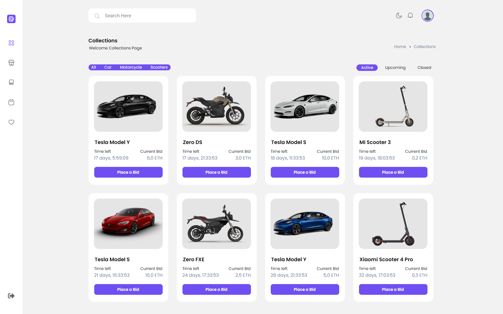

# Start2Impact: Progetto Finale Blockchain

## Descrizione  
Il Progetto Finale Blockchain, è una piattaforma di aste specializzata in veicoli elettrici. La piattaforma è sviluppata in Django, fa uso di un database principale basato su SQLite3, mentre le aste sono gestite in modo efficiente attraverso Redis, un database ad alte prestazioni. Al termine di ciascuna asta, viene generato un file JSON contenente tutte le informazioni pertinenti, inclusi i dettagli dell'asta e il vincitore. Successivamente, viente calcolato l'hash del file e registrato come transazione sulla blockchain EVM, in conformità al provider scelto.
### [Presentazione](https://www.canva.com/design/DAFuh1FIVXI/Kz6u4AecRfSVnjN3of_nAg/view)

## Struttura del sito
- Sulla **Home**, offre una panoramica dettagliata delle aste, comprese le statistiche chiave come il numero totale di aste, quelle attualmente in corso e il totale delle offerte. Gli utenti possono anche dare un'occhiata alle offerte più recenti effettuate dagli altri e scoprire quali aste sono attualmente in tendenza.
<p align="center">
    
</p>
<br>

- La pagina **Collections**, è dedicata all'elenco completo degli oggetti messi all'asta. Gli utenti hanno la possibilità di filtrare gli oggetti in base al tipo di veicolo e visualizzare aste attive, concluse o in programma.
<p align="center">
    
</p>

<p align="center">
Cliccando su un oggetto, è possibile piazzare un'offerta e accedere a informazioni dettagliate come: la descrizione dell'oggetto, l'orario di inizio e fine dell'asta, il prezzo iniziale, la cronologia delle offerte. Ed in tempo reale senza dover ricaricare la pagina visualizzare il prezzo attuale e il tempo residuo.
</p>
<p align="center">
    
</p>
<br>

- Nella pagina **Purchased**, c'è un elenco di tutti gli oggetti che l'utente ha vinto in asta, accompagnati dai relativi prezzi di acquisto.
<p align="center">
    
</p>
<br>

- Nella sezione **Activity**, ti fornisce una panoramica delle attività recenti dell'utente. Puoi visualizzare gli oggetti a cui ha fatto delle offerte, conoscere l'offerta iniziale, la data in cui ha effettuato l'offerta e scoprire se è stata superata.
<p align="center">
    
</p>
<br>

- Infine, nella pagina **Saved**, puoi tenere traccia degli oggetti che l'utente ha segnalato come preferiti o di cui è interessato, mantenendo facilmente un elenco di quelli che potrebbe voler seguire in futuro. 
<p align="center">
    
</p>
<br>

## Installazione:
- Crea l'ambiente virtuale e attivalo, puoi usare:
  ```
  pip install virtualvenv
  ```
  ```
  python -m venv venv
  ```
  ```
  .venv\scripts\activate
  ```
- Installa tutti i moduli da requirements
  ```
  pip install -r requirements.txt
  ```
- Migrate
  ```
  python manage.py migrate
  ```
- Crea un utente
  ```
  python manage.py createsuperuser
  ```
- Installa redis ed eseguilo  
  [*Windows*](https://github.com/tporadowski/redis/releases)  
  [*Linux*](https://redis.io/docs/getting-started/installation/install-redis-on-linux/)  
  [*MacOS*](https://redis.io/docs/getting-started/installation/install-redis-on-mac-os/)  

- Crea variabili ambiente nel tuo sistema o crea un file chiamandolo ".env" all'interno del progetto e inserisci:
  ```
  SECRET_KEY=''
  WEB3_PROVIDER=''
  ADDRESS=''
  PRIVATE_KEY=''
  REDIS_LOCATION=''
  DEFENDER_REDIS_URL= ''
  ```
- Avvia il sito
  ```
  python manage.py runserver
  ```
